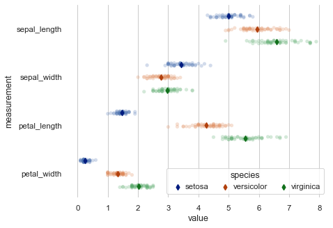

# Welcome to our [team project website!](https://owenfitz.github.io/owen-and-some-dudez/)

This is a website to showcase our final project for FIN 377 - Data Science for Finance course at Lehigh University.

To see the complete analysis file(s) click [here](https://github.com/julioveracruz/testwebsite/blob/main/notebooks/example.ipynb).

Maybe you want a different website them for the project? Consider `minimal-mistakes`:
1. [Go here](https://github.com/mmistakes/mm-github-pages-starter/generate).
2. In the resulting repo, click Settings, then Pages, then make sure the source is the main branch.
3. [The doc site is here](https://mmistakes.github.io/minimal-mistakes/docs/structure/) and will help you customize layouts and figure out how to use it.

## Table of contents
1. [Introduction](#introduction)
2. [Methodology](#meth)
3. [Data](#section2)
    1. [Dataset](#subsec2-1)
    2. [EDA](#subsec2-2)
4. [Our Models](#section3)
5. [Analysis Section](#section4)
6. [Summary](#summary)

## Introduction  <a name="introduction"></a>

### Research Question
Do demographics affect financial institutions' decision on whether or not to give a loan to a loan applicant?

### Hypothesis
If the model including the demographic variables is more accurate (recall, precision, accuracy, f1?) than the model excluding demographics, then this financial institution is coming to their conclusion on loans in an illegal manner by basing their decisions on demographics. We hypothesize that the loan grantors from our dataset are making decisions on granting loans differently based on the three variables they provide such as debt-to-income ratio, collateral, and credit history; by incorporating demographic information we can possibly see if there is any correlation with denial or acceptance of the loan. Multiple records do not have reasons for denial which could help build the correlation between demographics and the acceptance or rejection of a loan request.

### Path to Success
We will test this hypothesis by creating a base model that includes information about the loan applicant such as loan amount, applicant income, and whether or not there is a co-applicant. We will then see how accurate the model is by comparing the results of whether or not the loan was given, which is provided by the dataset. Then we will create another model that contains the original variables and add the demographic variables in the dataset. Again, we will compare the results of our model to the actual results. After doing so, we will be able to compare the accuracy of both models to each other. Then we will be able to observe if the financial institution is making their decisions based on demographics instead of only the financial information needed to make a proper decision.

## Methodology <a name="meth"></a>

Here is some code that we used to develop our analysis. Blah Blah. [More details are provided in the Appendix](page2).
 
Note that for the purposes of the website, you have to copy this code into the markdown file and  
put the code inside trip backticks with the keyword `python`.

```python
import seaborn as sns 
iris = sns.load_dataset('iris') 

print(iris.head(),  '\n---')
print(iris.tail(),  '\n---')
print(iris.columns, '\n---')
print("The shape is: ",iris.shape, '\n---')
print("Info:",iris.info(), '\n---') # memory usage, name, dtype, and # of non-null obs (--> # of missing obs) per variable
print(iris.describe(), '\n---') # summary stats, and you can customize the list!
print(iris['species'].value_counts()[:10], '\n---')
print(iris['species'].nunique(), '\n---')
```

Notice that the output does NOT show! **You have to copy in figures and tables from the notebooks.**

## Data <a name="section2"></a>
Blah blah

### Dataset <a name="subsec2-1"></a>
This is a subsection, formatted in heading 3 style

### EDA <a name="subsec2-2"></a>
This is a subsection, formatted in heading 3 style
<br><br>

<br><br>

## Our Models <a name="section3"></a>

## Analysis Section <a name="section4"></a>

Here are some graphs that we created in our analysis. We saved them to the `pics/` subfolder and include them via the usual markdown syntax for pictures.


<br><br>
Some analysis here
<br><br>

<br><br>
More analysis here.
<br><br>

<br><br>
More analysis.

## Summary <a name="summary"></a>

Blah blah


## About the team


<br>
Julio is a senior at Lehigh studying finance.
<br><br><br>

<br>
Don is an assistant professor at Lehigh.


## More 

To view the GitHub repo for this website, click [here](https://github.com/owenfitz/owen-and-some-dudez).
