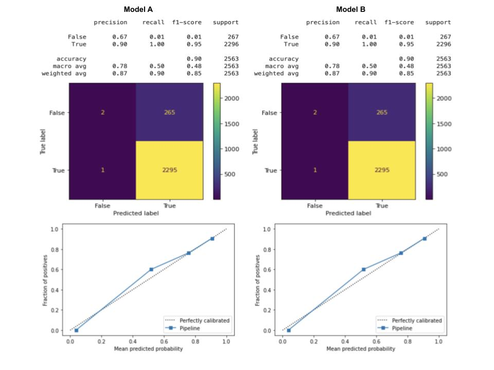
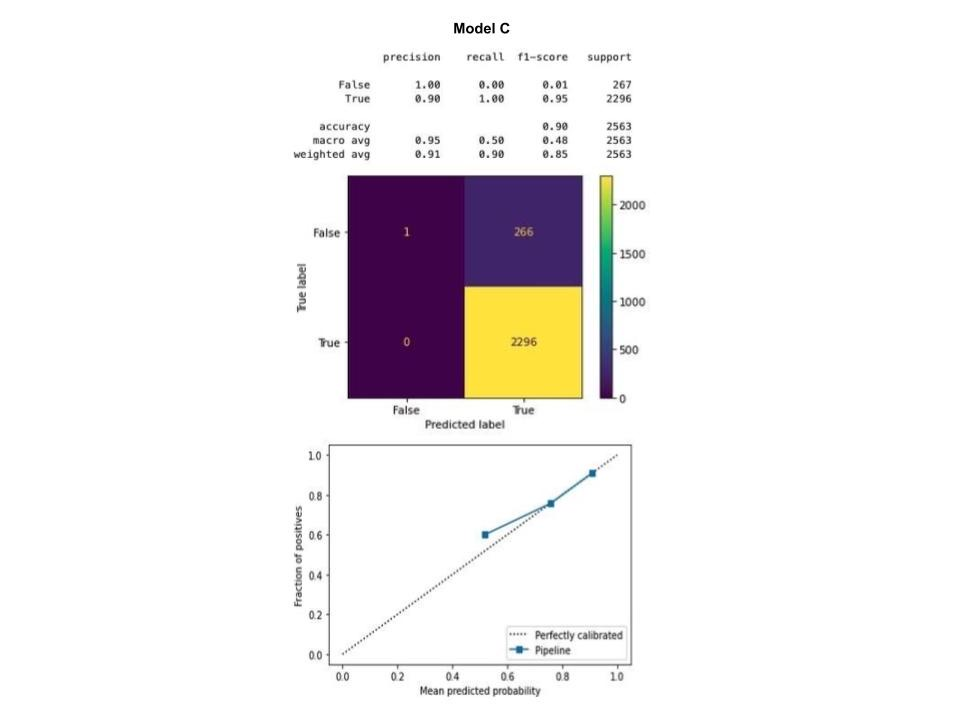
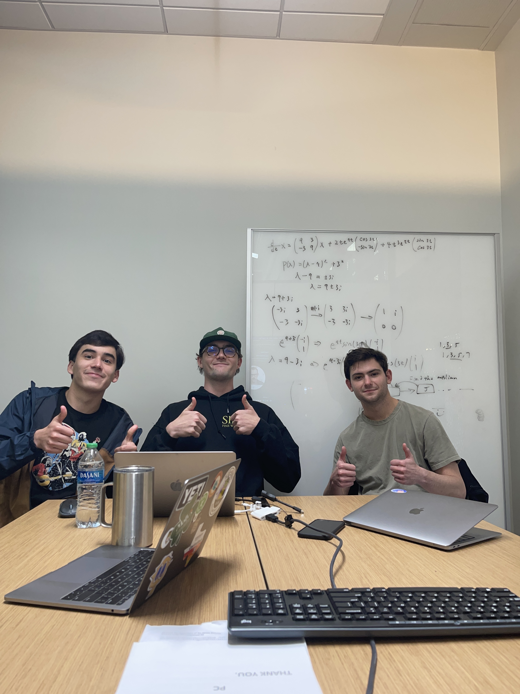

# Welcome to Owen and Some Dudez' [team project website!](https://owenfitz.github.io/owen-and-some-dudez/)

This is a website to showcase our final project for FIN 377 - Data Science for Finance course at Lehigh University.

To see the complete analysis file(s) click [here](https://github.com/julioveracruz/testwebsite/blob/main/notebooks/example.ipynb).

## Table of contents
1. [Introduction](#introduction)
2. [Data](#section2)
    1. [Dataset](#subsec2-1)
    2. [EDA](#subsec2-2)
3. [Our Models](#section3)
4. [Analysis Section](#section4)
5. [Summary](#summary)

## Introduction  

### Research Question
Do demographics affect financial institutions' decision on whether or not to give a loan to a loan applicant?

### Hypothesis
If the model including the demographic variables is more accurate (recall, precision, accuracy, f1) than the model excluding demographics, then this financial institution is coming to their conclusion on loans in an illegal manner by basing their decisions on demographics. We hypothesize that the loan grantors from our dataset are making decisions on granting loans differently based on the three variables they provide such as debt-to-income ratio, collateral, and credit history; by incorporating demographic information we can possibly see if there is any correlation with denial or acceptance of the loan. Multiple records do not have reasons for denial which could help build the correlation between demographics and the acceptance or rejection of a loan request.

### Path to Success
We will test this hypothesis by creating a base model that includes information about the loan applicant such as loan amount, applicant income, and whether or not there is a co-applicant. We will then see how accurate the model is by comparing the results of whether or not the loan was given, which is provided by the dataset. Then we will create another model that contains the original variables and add the demographic variables in the dataset. Again, we will compare the results of our model to the actual results. After doing so, we will be able to compare the accuracy of both models to each other. Then we will be able to observe if the financial institution is making their decisions based on demographics instead of only the financial information needed to make a proper decision.

## Data 

### Dataset 
- First we downloaded the dataset to our computer.
We then put the dataset into a folder labeled "inputs" so that the file would be in our project repo labeled "project-owen-and-some-dudez"
- To load the dataset into jupyter lab we ran: mortgage = pd.read_csv('Input/mortgage.csv')
- The sample period is from 2017 (this is the most recent period on any of the state datasets on loan information from the website we decided on using:    [www.consumerfinance.gov](https://www.consumerfinance.gov/))
- "We’re the Consumer Financial Protection Bureau, a U.S. government agency dedicated to making sure you are treated fairly by banks, lenders and other financial institutions" (taken from [www.consumerfinance.gov](https://www.consumerfinance.gov/)).

### EDA 

#### Main Observations:
- Unit of Observation: respondent_ID
- Time period: the year: 2017
- Number of Observations: 473,757

#### Interesting Findings from EDA:
Outliers:
loan_amount_000s
applicant_income_000s
Population

Races:
- 1 = Returned Nothing
- 2 = Asian
- 3 = Black or African American
- 4 = Native Hawaiian or Other Pacific Islander
- 5 = White
- 6 = Information not provided by applicant in mail, Internet, or telephone application
- 7 = Not applicable
- For 19,563 loan applications, the information of the applicant's race was not provided

  

  

  

  

Action Taken:
- 1 - Loan originated
- 2 - Application approved but not accepted
- 3 - Application denied by financial institution
- 4 - Application withdrawn by applicant
- 5 - File closed for incompleteness
- 6 - Loan purchased by the institution
- 7 - Preapproval request denied by financial institution
- 8 - Preapproval request approved but not accepted

## Our Models 
- Two Models  
    - Both are set up the same except for one key difference
    - One model does not include any of the applicants’ demographic information (Model A) and one with all the information (Model B)
- Used pandas to create dataframe using the training csv with all of the loan application information (10,000 applications)
- In Model A, we dropped every column considered to be a demographic using df.drop
    -(co)applicant ethnicity, (co)applicant race, (co)applicant sex, county, minority population, and census tract number 
- For both models 
    - Removed all of the columns where 95% of applicants had no variable 
    - Removed all applications that were action taken was not application accepted or application denied
        - We did not want to include actions like application withdrawn
    - Made our y= application denied 
    - Removed entire action taken column from dataframe 
    - Created a preprocessor that included all numerical columns and purpose of loan and dropped every other categorical variable
        - Did not need to exclude demographic numerical variables from Model A because we had already done so
    - Created Pipeline that processes data and then runs a logistic regression on that data 
    - Fit the model to the training data 
    - Analyzed the accuracy of our models
    - Imported the holdout dataset (over 400,000 applications)
        - Cleaned the data frame the same way we cleaned the training data
    - Used both models to predict the action taken for each of the applications
    - Created new datasets for each model that contained the predictions
- Third Model! (Model C)
    - Created a model where we only dropped applicant income to see how it would differ from A and B	
## Analysis Section 

Here is a collage of our prediciton scores for Model A & B that we created in our analysis. 

  

  

  

## Summary 

Blah blah

## About the team

 
All three members of the team are Juniors at Lehigh University studying Finance!
 
Sebastian (left) is from Houston, TX. He enjoys bowling and attending concerts.
 
Owen (middle) is from New Rochelle, NY. He loves sailing and puzzles!
 
Matt (right) is from Manhattan, NY. He likes to play rugby and eating a good New York slice of 'Za.
   

## More 

To view the GitHub repo for this website, click [here](https://github.com/owenfitz/owen-and-some-dudez).
